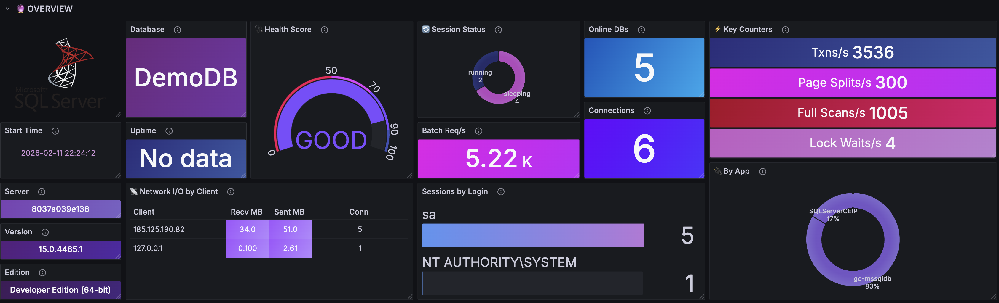
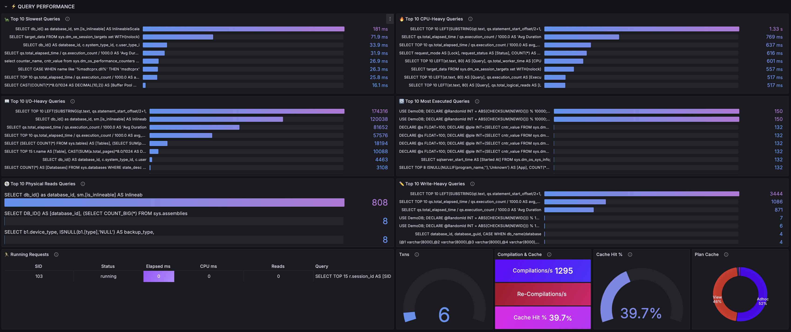
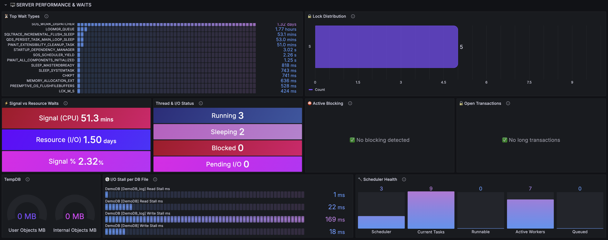
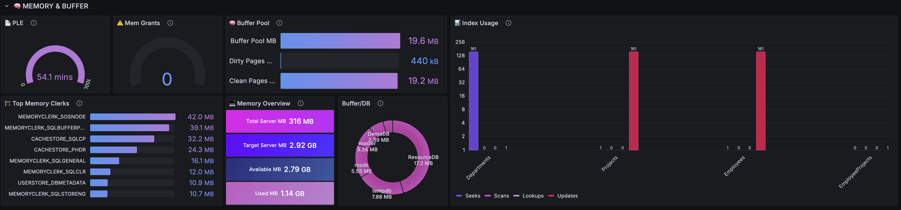
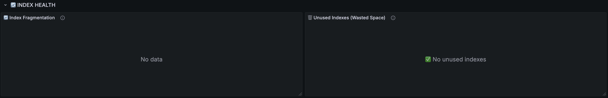
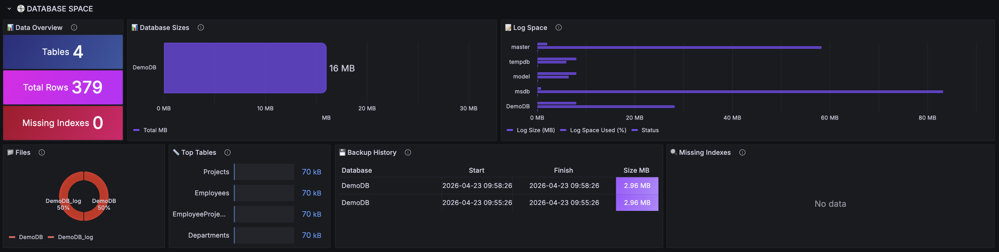
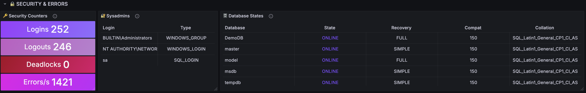
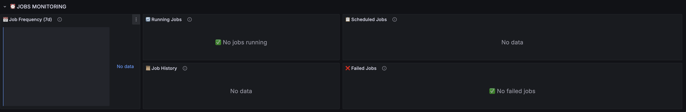

	
	
	
	
	

# 🔮 Monitoring Microsoft SQL Server with Grafana

> **Pure T-SQL • Zero Prometheus • 60+ Panels • 8 Sections**

A comprehensive Grafana dashboard for monitoring Microsoft SQL Server using **only native T-SQL DMVs** — no exporters, no Prometheus, no agents. Just connect Grafana directly to your SQL Server and get full observability.

The detailed list of all exported metrics and their SQL queries is maintained [here](docs/metrics.md).

A Docker Compose quickstart is available if you want to test the dashboard in minutes. Available [here](quickstart/README.md).

---

## ✨ What's New (v2)

| Feature | Description |
|---------|-------------|
| 🩺 **Health Score** | Composite gauge (0-100) combining PLE, blocking, memory grants, and cache hit ratio |
| ⚡ **Signal vs Resource Waits** | Instantly identify CPU pressure vs I/O pressure |
| 🔄 **Index Fragmentation** | Table with rebuild/reorganize recommendations |
| 🗑 **Unused Indexes** | Detect wasted space from indexes that cost writes but get zero reads |
| 📡 **Network I/O by Client** | Bytes sent/received per client IP |
| 🔌 **Connections by App** | Donut chart showing which applications connect |
| 🔐 **Sysadmin Audit** | Security table listing all sysadmin role members |
| 💿 **Physical Reads & Writes** | Two new query performance panels for disk-level I/O |
| 🔓 **Open Transactions** | Long-running transactions that may cause blocking |
| 🔄 **Session Status** | Donut breakdown of running/sleeping/dormant sessions |
| 📊 **Key Counters** | Transactions/s, Page Splits/s, Full Scans/s, Lock Waits/s |
| 💻 **Memory Overview** | Total/Target/Available/Used server memory in one view |

---

## 📊 Dashboard Sections

### 🔮 Overview

At-a-glance view of your SQL Server instance health, including the **Health Score gauge**, version info, key performance counters, connections by application, session status breakdown, and network I/O per client.

- **Health Score**: Composite 0-100 gauge (PLE + blocking + memory grants + cache hit)
- **Server Info**: Database, Version, Edition, Server Name, Uptime, Online DBs
- **Key Counters**: Batch Requests/s, Transactions/s, Page Splits/s, Full Scans/s, Lock Waits/s
- **Sessions**: Active sessions by login, connections by application (donut), session status (donut)
- **Network**: Network I/O per client IP (bytes sent/received)
- **Start Time**: SQL Server start timestamp

### ⚡ Query Performance

Deep dive into query-level performance with six different Top 10 rankings, compilation stats, and a live running requests table.

- **🐢 Top 10 Slowest Queries** (avg elapsed time)
- **🔥 Top 10 CPU-Heavy Queries** (total worker time)
- **📖 Top 10 I/O-Heavy Queries** (logical reads)
- **🔁 Top 10 Most Executed Queries** (execution count)
- **💿 Top 10 Physical Reads Queries** (disk reads)
- **✏️ Top 10 Write-Heavy Queries** (logical writes)
- **Compilation & Cache Stats**: Compilations/s, Re-Compilations/s, Cache Hit %
- **Plan Cache by Type**: Donut chart (Adhoc, Prepared, Proc, Trigger)
- **🏃 Currently Running Requests**: Live table with SID, status, elapsed time, CPU, reads, query text
- **Gauges**: Cache Hit %, Active Transactions

### 🖥 Server Performance & Waits

Server-level performance indicators including wait analysis, lock distribution, blocking detection, and scheduler health.

- **⏳ Top 15 Wait Types** (LCD bar gauge, excludes benign waits)
- **🔒 Lock Distribution** (stacked bar chart by mode and status)
- **⚡ Signal vs Resource Waits**: CPU pressure (signal) vs I/O pressure (resource) with percentage
- **Thread & I/O Status**: Running, Sleeping, Blocked, Pending I/O
- **⛔ Active Blocking Chains**: Live table with blocker SID, wait type, wait time, query text
- **🔓 Open Transactions**: Long-running transactions with session details and duration
- **TempDB Allocation**: Donut chart (user vs internal objects)
- **💿 I/O Stall per DB File**: LCD bar gauge showing read/write stalls
- **🔧 Scheduler Health**: Bar chart per scheduler (tasks, runnable, workers, queued)

### 🧠 Memory & Buffer

Memory pressure indicators, buffer pool analysis, and memory allocation breakdown.

- **📄 Page Life Expectancy**: Gauge with threshold labels (300s = warning, 600s = good)
- **⚠️ Memory Grants Pending**: Gauge (non-zero = memory pressure)
- **🧠 Buffer Pool Breakdown**: Buffer Pool MB, Dirty Pages MB, Clean Pages MB
- **💻 Memory Overview**: Total Server, Target Server, Available, Used (combined stat panel)
- **🏗 Top 10 Memory Clerks**: Where SQL Server allocates memory
- **Buffer per Database**: Donut chart showing buffer pool distribution across databases
- **📊 Index Usage**: Bar chart with seeks, scans, lookups, updates per table (log scale)

### 🔄 Index Health

Proactive index maintenance insights powered by `sys.dm_db_index_physical_stats` and `sys.dm_db_index_usage_stats`.

- **🔄 Index Fragmentation**: Table with fragmentation %, page count, and recommended action (OK / REORGANIZE / REBUILD)
- **🗑 Unused Indexes**: Indexes with zero reads but ongoing write cost — candidates for removal

### 💿 Database Space

Storage monitoring including database sizes, log space, file distribution, table sizes, and backup history.

- **📊 Database Sizes**: Horizontal bar chart (all databases > system DBs)
- **📝 Transaction Log Space**: Via `DBCC SQLPERF(LOGSPACE)`
- **📁 File Distribution**: Donut chart of all database files
- **📏 Top 15 Tables by Size**: Bar gauge
- **💾 Backup History**: Table with database, start/finish, size
- **📊 Data Overview**: Tables count, Total Rows, Missing Indexes count
- **🔍 Missing Index Suggestions**: Table from query optimizer with equality/inequality columns and estimated impact

### 🔒 Security & Errors

Security audit and error monitoring.

- **🔑 Security Counters**: Logins, Logouts, Deadlocks, Errors/sec (combined stat panel)
- **🔐 Sysadmin Members**: Table listing all active logins with sysadmin role
- **🗄 Database States**: Table with state (color-mapped: ONLINE/OFFLINE/SUSPECT), recovery model, compatibility level, collation

### ⏰ Jobs Monitoring

SQL Agent job observability.

- **📅 Job Frequency (7d)**: Execution count per job over the last 7 days
- **🔄 Running Jobs**: Currently executing jobs with duration
- **📋 Scheduled Jobs**: Upcoming jobs with status (Running/Scheduled color-coded)
- **📜 Job History**: Recent job executions with duration
- **❌ Failed Jobs**: Failed job details with error messages

---

## 🚀 Quick Start

### Option 1: Docker Compose (recommended for testing)

See the full [quickstart guide](quickstart/README.md) for details.

### Option 2: Import directly

1. Add a **Microsoft SQL Server** data source in Grafana pointing to your instance
2. Import the dashboard from [Grafana.com (ID: 21378)](https://grafana.com/grafana/dashboards/21378-microsoft-sql-server-dashboard/)
3. Select your MSSQL data source and enjoy

### Data Source Configuration

| Parameter | Value |
|-----------|-------|
| **Host** | `your-server:1433` |
| **Database** | Your target database |
| **User** | `SA` or a dedicated monitoring user |
| **Encrypt** | `false` for local/Docker, `true` for production |

> **Tip**: For production, create a dedicated monitoring login with `VIEW SERVER STATE` and `VIEW ANY DEFINITION` permissions instead of using SA.

---

## 🤝 Contributing

All contributions are welcome! Whether bug fixes, improvements, or new panels — feel free to open a PR or issue.

If you find this project useful, please give it a star ⭐️ ! Your support is greatly appreciated.

## Stargazers over time

