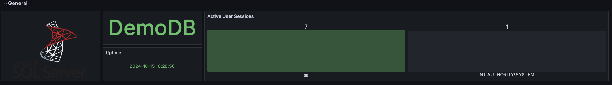
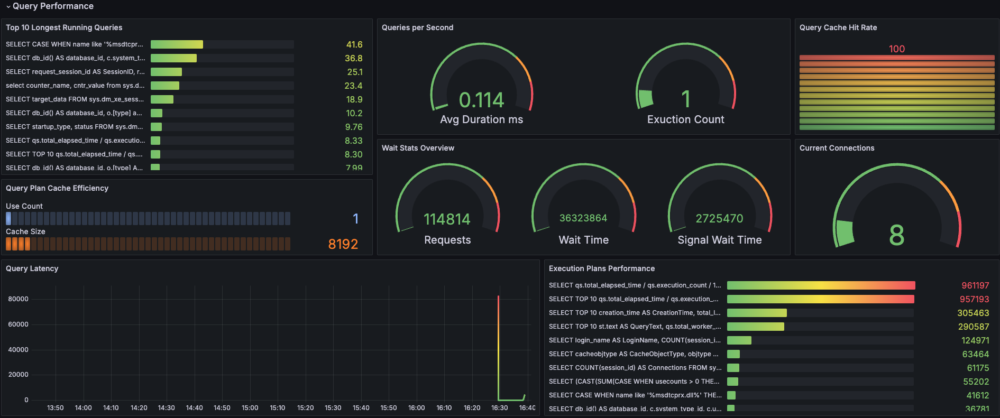
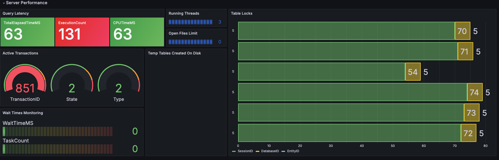
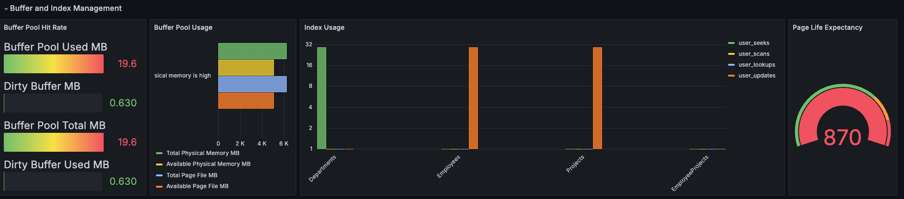
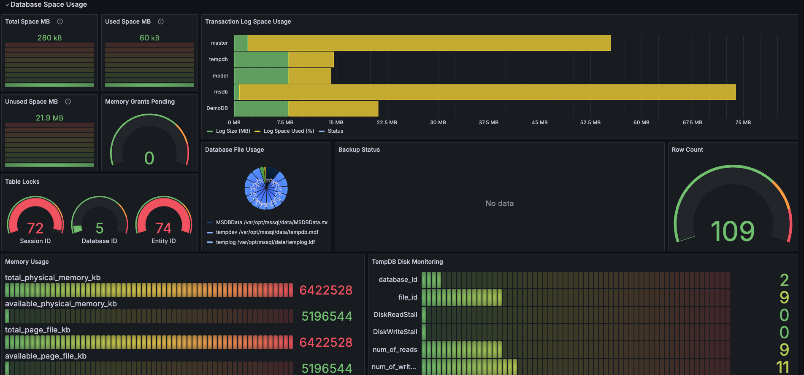
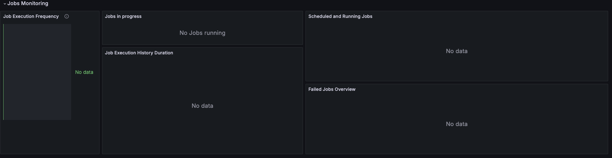

	
	
	
	
	

# Monitoring Microsoft SQL Server with Grafana

Example of the metrics you should expect to retrieve; the detailed list of exported metrics is maintained [here](docs/metrics.md).

A Docker Compose setup is available if you wish to test the dashboard. Available [here](quickstart/README.md).

## Features

This is a comprehensive Grafana dashboard designed for monitoring Microsoft SQL Server. It provides real-time insights into your SQL Server environment, making it easy for both technical and non-technical users to understand the performance of their SQL Server instances.

## Data Source Setup
The data source for this dashboard can directly be your SQL Server database instance. Ensure that the SQL Server instance is accessible to Grafana.

### General
- **Database name**: Displays the database name.
- **Uptime**: Displays the SQL Server start time.
- **Active User Sessions**: Shows the count of active user sessions by login name.

### Query Performance
- **Top 10 Longest Running Queries**: Lists the top 10 queries with the longest average duration.
- **Queries per Second**: Provides average duration and execution count of queries.
- **Query Cache Hit Rate**: Visualizes the cache hit ratio for queries.
- **Query Plan Cache Efficiency**: Shows the efficiency of cached query plans.
- **Wait Stats Overview**: Displays an overview of wait statistics in SQL Server.
- **Current Connections**: Indicates the current number of connections to the SQL Server.
- **Query Latency**: Visualizes latency for recent queries.
- **Execution Plans Performance**: Monitors performance metrics of executed plans.

### Server Performance
- **Query Latency**: Displays the top 10 longest running queries based on total elapsed time.
- **Running Threads**: Displays the number of running threads in the SQL Server.
- **Open Files Limit**: Shows the count of currently open files.
- **Active Transactions**: Provides details on active transactions in the system.
- **Temp Tables Created On Disk**: Monitors the number of temporary tables created on disk.
- **Table Locks**: Displays information on current table locks.
- **Waiting Times Monitoring**: Provides an overview of wait statistics in SQL Server.

### Buffer and Index Management
- **Buffer Pool Hit Rate**: Visualizes the hit rate of the buffer pool.
- **Buffer Pool Usage**: Monitors the overall usage of the buffer pool.
- **Index Usage**: Displays usage statistics for database indexes.
- **Page Life Expectancy**: Shows the average time pages stay in the buffer pool.

### Database Space Usage
- **Total Space**: Displays the total space allocated to all tables in the database.
- **Used Space**: Shows the space currently used by all tables.
- **Unused Space**: Provides information on unused space in the database.
- **Memory Grants Pending**: Indicates the count of pending memory grants.
- **Transaction Log Space Usage**: Displays the usage of transaction log space.
- **Database File Usage**: Shows details about database files and their sizes.
- **Table Locks**: Provides information on current table locks.
- **Backups Status**: Displays the status of recent database backups.
- **Memory Usage**: Visualizes overall memory usage in SQL Server.
- **TempDB Disk Monitoring**: Monitors I/O stalls for TempDB files.
- 

### Jobs Monitoring
- **Job Execution Frequency**: Displays the execution count of jobs over the last week.
- **Job Execution History Duration**: Shows job execution history along with durations.
- **Jobs in Progress**: Lists jobs that are currently running along with their durations.
- **Failed Jobs Overview**: Provides an overview of recently failed jobs and their error messages.
- **Scheduled and Running Jobs**: Displays the status of scheduled and currently running jobs.

You can directly find the [dashboard here](https://grafana.com/grafana/dashboards/21378-microsoft-sql-server-dashboard/) or use the ID: 21378.

--- 

If you find this project useful, please give it a star ⭐️ ! Your support is greatly appreciated. Also, feel free to contribute to this project. All contributions, whether bug fixes, improvements, or new features, are welcome!
